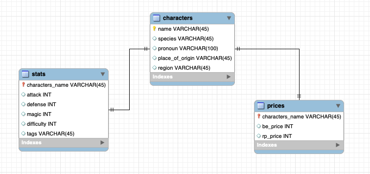

# Mini Project: API and Web Data Scraping

League of Legends (LoL) is a MOBA (Multiplayer Online Battle Arena) game where players choose a character (champion) and play in teams of 5 to destroy the other's team base. In this miniproject I've collected data about the characters through both use of the [Data Dragon API](https://developer.riotgames.com/docs/lol) and web scraping of the [League of Legends Fandom Wiki](https://leagueoflegends.fandom.com/wiki/League_of_Legends_Wiki).

## Database structure

## Methodology
### API
- Used `requests` module to access data in the [Data Dragon API](https://developer.riotgames.com/docs/lol), storing the current version of the game from the Versions file, and accessed al characters in the version in the Champions file. 
- Stored the names of the characters, as well as their stats (attack, defense, magic, difficulty)and tags, in a pandas dataframe.
### Web Scraping
- Accesed and scraped data from the [League of Legends Fandom Wiki](https://leagueoflegends.fandom.com/wiki/League_of_Legends_Wiki) with the `BeautifulSoup` module. Iterating over all character names obtained in the previous step, I stored information in two pandas dataframes about:
  - Prices. Information taken from the pages with the structure `https://leagueoflegends.fandom.com/wiki/{champ}/LoL`. Includes prices of the characters in BE (Blue Essence) and RP (Riot Points).
  - Characters info. Information taken from the pages with the structure `https://leagueoflegends.fandom.com/wiki/{champ}`. Includes species, pronoun, place of origin, and region.
### SQL
- Created SQL model in MySQL with three tables, following the structure of the three pandas dataframes created.
### SQL <--> Python Connection
- Using the `sqlalchemy` module, I inserted all the data in the dataframes in their respective tables in the database stored in MySQL.